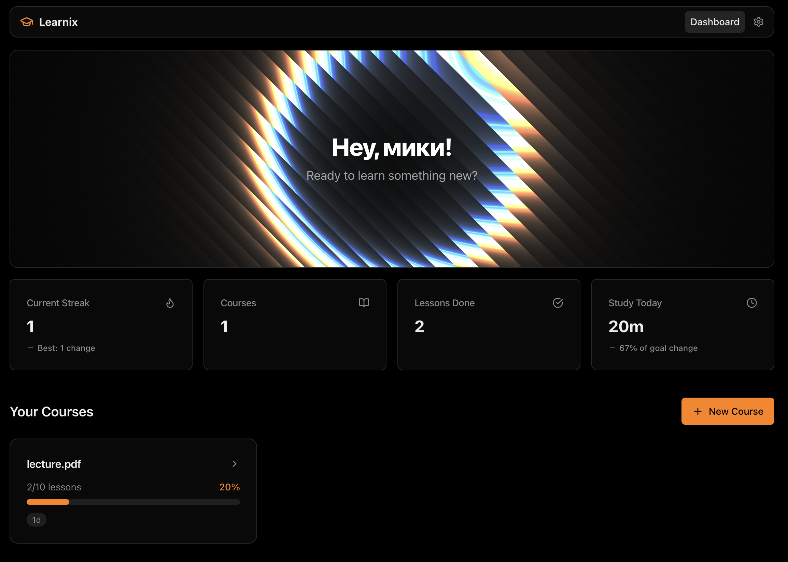
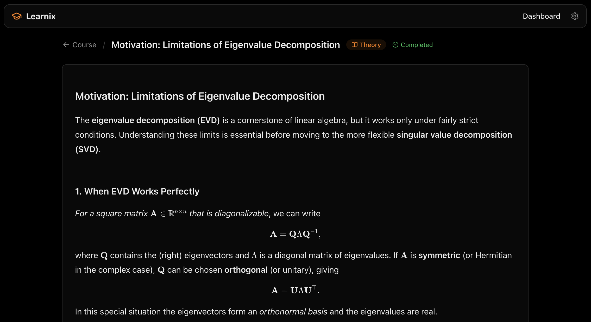

# Learnix

Telegram-first smart study assistant: AI-generated courses, a web dashboard, and a bot for plans, reminders, and guided practice—backed by FastAPI, PostgreSQL, React, and Ollama.

## Demo

| Dashboard | Learning |
| --- | --- |
|  |  |

## Product context

**End users**  
Students and self-learners who already use **Telegram** daily and want structure without juggling separate “chat with AI” tabs that forget their syllabus the next day.

**Problem**  
Generic chatbots do not persist a real **course structure** (sections, lessons, tasks), do not turn uploads into durable **study material**, and do not tie progress to **habits** (streaks, reminders) in the same place students already check messages.

**Solution**  
**Learnix** keeps **courses and lessons** in a database, uses **Ollama** to generate syllabi and lesson content from a topic (and optional reference text), exposes a **React** web app for deep reading and exercises, and uses an **aiogram** bot for **daily nudges**, quick links to the web app, and a consistent **API-key + Telegram user ID** identity model.

## Features

### Implemented

- **Courses & lessons:** Create courses (topic, duration, optional file text); AI builds a syllabus and per-lesson content (theory, practice, exam-style questions).
- **Web dashboard:** Progress overview, metrics (streak, lessons, study time), course list, course detail with lesson navigation.
- **Lesson experience:** Markdown + LaTeX rendering, practice tasks with AI grading (JSON), exam sections, side AI tutor chat, “complete lesson” flow.
- **Study time & streaks:** Minutes counted toward daily goals when lessons are completed (and related streak logic on the backend).
- **Telegram bot:** Menu, web-app links, integration with the same backend as the web UI.
- **Notifications:** User timezone, daily reminder time, and optional dated reminders (stored in the API; bot dispatch uses internal endpoints).
- **Deployment:** `docker compose` stack: Postgres, API, static web (Caddy), bot; optional **Ollama** on the host or **Ollama Cloud** via env vars.
- **Auth (MVP):** Protected routes require `X-API-Key` and `X-Telegram-User-Id` (bot and web send these after session bootstrap).

### Not yet implemented (roadmap)

- **Multiple languages:** UI and lesson content localization (i18n), plus model prompts tuned per locale.
- **Spaced repetition:** Export or built-in decks (e.g. Anki) from lesson highlights and wrong answers.
- **Rich LMS integration:** Deep link-out to Canvas/Moodle with grade sync (settings mention future LMS API key).
- **Native mobile apps:** Dedicated iOS/Android clients beyond Telegram WebApp and the browser.
- **Collaborative study:** Shared courses, study groups, and peer progress visibility.
- **Offline mode:** Download lessons for offline reading without network.
- **Accessibility extras:** Screen-reader-first lesson layouts, optional TTS for lesson body text.

## Usage

1. **Get access via Telegram**  
   Use the project’s bot (token configured by operators). Open the **Web app** link from the bot menu or the flow your deployment documents so the browser receives a valid web session (the UI expects the Telegram-linked flow).

2. **Web dashboard**  
   Open the deployed web URL (e.g. `https://your-host/`). You should see courses, streaks, and “Study today” style metrics. Create a **new course** from the dashboard; wait for generation to finish if the course status shows generating.

3. **Study a course**  
   Open a course, pick a lesson from the sidebar. Read the material, use the **AI chat** for questions, complete **practice** (submit answers for grading), finish **exam** items if present, then use **Complete & continue** when the UI allows.

4. **Settings**  
   Set **timezone** and **daily reminder** (and optional one-off reminders) so Telegram messages fire at the correct local time.

5. **API**  
   Operators can inspect OpenAPI at `http://<api-host>:8000/docs` when the API is exposed (development or VPN-only in production).

**Local development (no full Docker stack for web):** from `web/`, `npm install && npm run dev` with Vite proxying `/api` to the API (see `.env.example` for `VITE_API_SECRET` alignment with `API_SECRET`).

## Deployment

Assume a fresh **Ubuntu 24.04 LTS** VM (same family as typical university lab images).

### What to install on the VM

- **Git** — clone the repository.
- **Docker Engine** and the **Docker Compose plugin** — run the stack (`docker compose`).
- **Optional but common for local LLM:** **Ollama** on the VM host (or use **Ollama Cloud** and skip a large local model).

You do *not* need to install Python or Node on the host if you only run services via Docker images built from this repo (the API and web Dockerfiles bundle runtimes). Install `uv` only if you run the API or bot directly on the host for debugging.

### Step-by-step deployment

1. **SSH into the VM** and update packages:

   ```bash
   sudo apt update && sudo apt upgrade -y
   ```

2. **Install Docker** (official Docker docs for Ubuntu 24.04), then ensure your user can run Docker:

   ```bash
   sudo usermod -aG docker "$USER"
   # log out and back in for group membership
   ```

3. **Clone the repository:**

   ```bash
   git clone <your-repo-url> learnix && cd learnix
   ```

4. **Configure environment**  
   Copy `.env.example` to `.env` at the repo root and set at minimum:

   - `API_SECRET` — shared secret for the API.
   - `VITE_API_SECRET` — **same value** as `API_SECRET` before building the web image (it is baked in at build time).
   - `TELEGRAM_BOT_TOKEN` — from [@BotFather](https://t.me/BotFather); required for the **bot** container to stay up.
   - `WEB_PUBLIC_BASE_URL` — public **HTTPS** URL of the web app (e.g. `https://learnix.example.edu`) so Telegram clients can open the WebApp; add that origin to `CORS_ORIGINS` for the API.
   - **Ollama:** either run Ollama on the VM and set `OLLAMA_MODE=local` and `OLLAMA_BASE_URL` (from inside Docker, the host is often `http://172.17.0.1:11434` on Linux, or publish Ollama on a host port and point the URL there), **or** set `OLLAMA_MODE=cloud`, `OLLAMA_BASE_URL=https://ollama.com`, and `OLLAMA_API_KEY`.

5. **Ollama on the same VM (typical local setup)**  
   Install Ollama, `ollama serve`, and `ollama pull <OLLAMA_MODEL>`. Ensure the API container can reach that address (`OLLAMA_BASE_URL` in `.env`).

6. **Build and start the stack:**

   ```bash
   docker compose up -d --build
   ```

   Services (see `docker-compose.yml`):

   | Service | Host port | Notes |
   | ------- | --------- | ----- |
   | Postgres | **5433** | Database (init script under `docker/`). |
   | API | **8000** | FastAPI; health at `/health`. |
   | Web | **5173** | Caddy serves the built SPA; proxies `/api/*` to the API. |
   | Bot | — | Long-running; needs `TELEGRAM_BOT_TOKEN`. |

7. **TLS and reverse proxy (production)**  
   Put **Caddy** or **nginx** with Let’s Encrypt in front of ports **5173** (web) and optionally **8000** (API) if you expose the API publicly; restrict `/docs` if needed.

8. **Migrations**  
   The API container runs `alembic upgrade head` on startup. For a fresh database, ensure Postgres is healthy before the API starts (`depends_on` handles ordering in Compose).

9. **Firewall**  
   Allow **443** (and **80** for ACME) for the web app; expose **8000** only on an admin network if you do not want a public API.

### Ollama notes

- **Docker API + Ollama on VM:** On Linux, `host.docker.internal` may be unavailable unless configured; prefer the host gateway IP or publish `11434` and use `http://<vm-ip>:11434` from compose via `OLLAMA_BASE_URL`.
- **Cloud mode:** No large model RAM on the VM; you need a valid Ollama.com API key and a cloud-capable model name.

## Tests

```bash
# Backend (Postgres test DB on 5433 — see docker/postgres-init.sql)
cd backend && uv sync --group dev && uv run pytest
```

```bash
cd bot && uv sync --group dev && uv run pytest
```

```bash
cd web && npx playwright install && npm run test:e2e
```

## Further reading

- `PLAN.md` — product scope and architecture notes.  
- `AGENT.md` — agent / automation guidelines for this repo.  
- `.env.example` — full list of environment variables.
